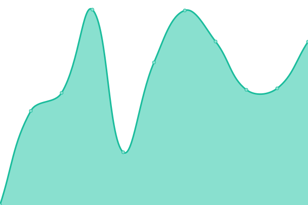
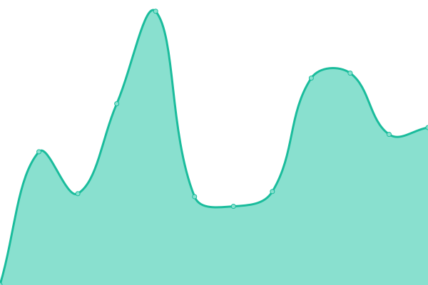

# [📈 Live Status](https://status.sekai.best): <!--live status--> **🟧 Partial outage**

This repository contains the open-source uptime monitor and status page for [Sekai-World](https://status.sekai.best), powered by [Upptime](https://github.com/upptime/upptime).

With [Upptime](https://upptime.js.org), you can get your own unlimited and free uptime monitor and status page, powered entirely by a GitHub repository. We use [Issues](https://github.com/Sekai-World/uptime-monitor/issues) as incident reports, [Actions](https://github.com/Sekai-World/uptime-monitor/actions) as uptime monitors, and [Pages](https://status.sekai.best) for the status page.

<!--start: status pages-->
<!-- This summary is generated by Upptime (https://github.com/upptime/upptime) -->
<!-- Do not edit this manually, your changes will be overwritten -->
<!-- prettier-ignore -->
| URL | Status | History | Response Time | Uptime |
| --- | ------ | ------- | ------------- | ------ |
|  [Sekai Viewer](https://sekai.best) | 🟩 Up | [sekai-viewer.yml](https://github.com/Sekai-World/uptime-monitor/commits/HEAD/history/sekai-viewer.yml) | 

 3031ms
     
 | 

<a href="https://status.sekai.best/history/sekai-viewer">99.81%</a>
    

|  [API](https://api.sekai.best/status) | 🟥 Down | [api.yml](https://github.com/Sekai-World/uptime-monitor/commits/HEAD/history/api.yml) | 

 1893ms
     
 | 

<a href="https://status.sekai.best/history/api">100.00%</a>
    

|  [Strapi](https://strapi.sekai.best) | 🟩 Up | [strapi.yml](https://github.com/Sekai-World/uptime-monitor/commits/HEAD/history/strapi.yml) | 

 1728ms
     
 | 

<a href="https://status.sekai.best/history/strapi">99.69%</a>
    

|  [Storage](https://storage.sekai.best/sekai-best-assets/models.json) | 🟩 Up | [storage.yml](https://github.com/Sekai-World/uptime-monitor/commits/HEAD/history/storage.yml) | 

 1601ms
     
 | 

<a href="https://status.sekai.best/history/storage">100.00%</a>
    

<!--end: status pages-->

[**Visit our status website →**](https://status.sekai.best)

## 📄 License

- Powered by: [Upptime](https://github.com/upptime/upptime)
- Code: [MIT](./LICENSE) © [Sekai-World](https://status.sekai.best)
- Data in the `./history` directory: [Open Database License](https://opendatacommons.org/licenses/odbl/1-0/)
